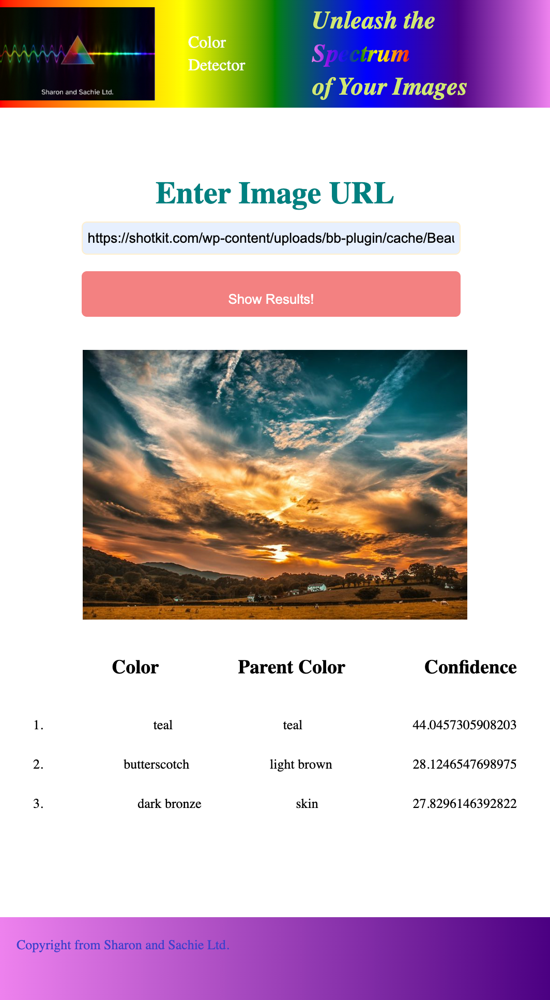
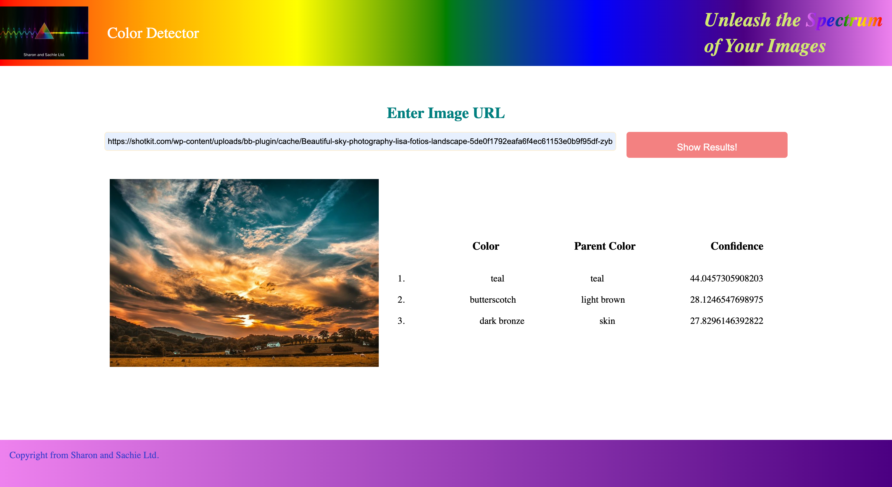

# Color Detect

**Implemented Imagga API integration to develop a React app, facilitating client and server-side functionalities.**   
- Languages/Tools: React, Node, Express, HTML/CSS, SASS

- Enabled image input from the webpage, utilized Imagga API to train the model, and generated color outputs with corresponding confidence levels.

  ### Mobile Version:

  

  

  

  ### Tablet and Desktop Version:

  
